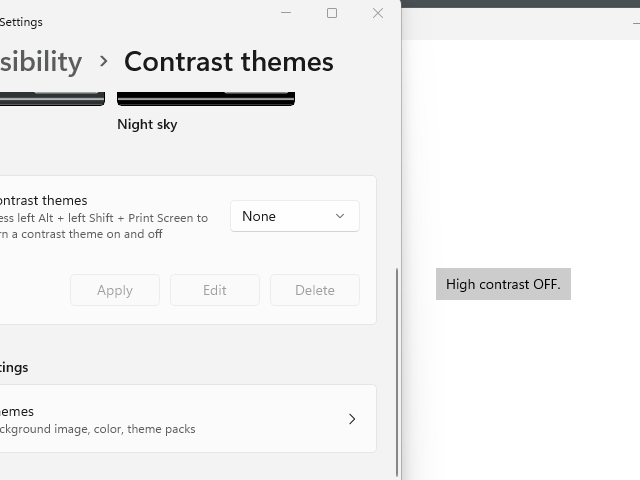

ThemeSettings 
===

# Background

In UWP, apps can use the
[AccessibilitySettings](https://learn.microsoft.com/en-us/uwp/api/windows.ui.viewmanagement.accessibilitysettings?view=winrt-22621)
API to query the system's high-contrast setting, and detect when it changes.  But in a Win32/non-UWP context, the
`AccessibilitySettings.HighContrastChanged` event never fires.

The API described in this doc, `ThemeSettings`, is a WinAppSDK WinRT API that provides functionality of `AccessibilitySettings`, but for a Win32
environment.  We expect to add other APIs to this type over time.

`AccessibilitySettings` uses the `CoreWindow` on the thread to notify it that the system theme has changed, by
subscribing to an internal `ThemeChanged` event on the `CoreWindow`. The `CoreWindow` fires this event in resposne to a
`WM_THEMECHANGED` window message.

This GIF shows how a user can change the HighContrast theme in the Settings app today, and a System Xaml app that displays the current `HighContrastScheme`:



# API Pages

## ThemeSettings class

Here is the proposed API for ThemeSettings, to be implemented in Microsoft.UI.dll (a new DLL):

``` c# (really midl3)
namespace Microsoft.UI.System
{
  runtimeclass ThemeSettings 
  {
    // WindowId must be a window whose top-level window is subclassed by WinAppSDK.
    // Only works for same-thread, same-process.
    static ThemeSettings CreateForWindowId(WindowId windowId);

    // Fired when system theme changes.
    // NOTE: We named the experimental version of this API "HighContrastChanged" because
    // it only fires when the HighContrast setting changes, and not during a change from
    // dark to light theme, for example.
    event TypedEventHandler<ThemeSettings, Object> Changed;

    // Parity with System AccessibilitySettings API.
    // NOTE: We were originally not going to add these APIs, but the implementation was
    // trivial so we added them to the experimental version.  We can remove them again
    // and tell apps to use the properties on AccessibilitySettings instead if desired.
    Boolean HighContrast { get; }
    String HighContrastScheme { get; } 

    // FUTURE: When we support cross-process or cross-thread islands, windowId
    // won’t be valid.  We'll want to create a ThemeSettings object based on an
    // island instead.
    //static ThemeSettings CreateForIsland(ContentIsland island);
  }
}

```

The `ThemeSettings` API allows Win32 WinRT apps to detect that the system's High Contrast setting
has changed.  The app constructs it by specifying a `WindowId`, which is a handle that represents
a top-level window that's participating in WinAppSDK's Content model.  An app can get a `WindowId`
from a `ContentWindow`/`ContentEnvironment` object, which is available from a `XamlRoot`, for 
example.

In this sample code, an app uses a `ThemeSettings` object to listen for high contrast changes
on the system.  

```c++
void MyApp::ListenForHighContrastChange(XamlRoot& xamlRoot) 
{
  const auto myWindowId = xamlRoot.ContentWindow().TopLevelWindowId();
  m_themeSettings = ThemeSettings::CreateForWindowId(myWindowId);

  m_themeSettings.Changed([xamlRoot](const ThemeSettings& ts, const auto&) {
    if (ts.HighContrast())
    {
      ::OutputDebugString(L"High contrast is ON, scheme is: ");
      ::OutputDebugString(ts.HighContrastScheme().c_str());
    }
    else
    {
      ::OutputDebugString(L"High contrast is OFF.\n");
    }
  });
}
```

## ThemeSettings.Changed property

The `Changed` event will only fire while the `ThemeSettings` object is alive, so apps must ensure
they hold a reference to the object as long as they want to receive the event.

The `Changed` event will only fire as long as the window represented by `WindowId` is alive.

## Other ThemeSettings members

The `HighContrast` and `HighContrastScheme` properties give the app information about the system setting the user
has selected for high-contrast.

| Name | Description |
|-|-|
| Boolean HighContrast | True if High Contrast mode is enabled on the system. |
| String HighContrastScheme | If HighContrast is true, a string from the system representing the High Contrast scheme, or style. |

Here's a screenshot of the Settings app where the user can select which Contrast theme to use:


For the above High Contrast Theme options, the HighContrast properties will return these values:
* None: `HighContrast` is `false`
* Aquatic: `HighContrast` is `true`, `HighContrastScheme` is `"High Contrast Black"`
* Desert: `HighContrast` is `true`, `HighContrastScheme` is `"High Contrast White"`
* Dusk: `HighContrast` is `true`, `HighContrastScheme` is `"High Contrast #1"`
* Night sky: `HighContrast` is `true`, `HighContrastScheme` is `"High Contrast #2"`

# Open Issues

In the experimental API today, HighContrastScheme returns a stale value if HighContrast is off.  We should change this to return
the empty string.

It seems easy to misuse this API by accidentally allowing the ThemeSettings object to go out of scope, which will mean the event
never fires.

# Appendix

Note in .net there is a
[SystemEvents](https://learn.microsoft.com/en-us/dotnet/api/microsoft.win32.systemevents?view=dotnet-plat-ext-7.0) type
that provides related APIs.  This is implemented by creating a top-level window to receive `WM_THEMECHANGED` and other
messages.  That implementation is
[here](https://github.com/microsoft/referencesource/blob/5697c29004a34d80acdaf5742d7e699022c64ecd/System/compmod/microsoft/win32/SystemEvents.cs).
